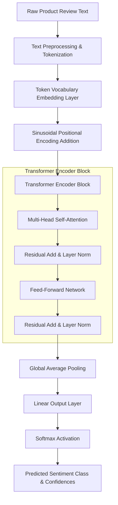

# 🎓 Implementation of a From-Scratch Transformer Architecture for Sentiment Classification on Product Reviews

### **A B.Sc. CSIT Final Year Capstone Project**
*Submitted in partial fulfillment of the requirements for the degree of Bachelor of Science in Computer Science and Information Technology (B.Sc. CSIT).*

---

## 👥 Project Team Members
This project was designed, implemented, and presented by:
1. **Philip Magar** (Roll No: 2078/CSIT/042) – *Lead Architecture & Backend Engineer*
2. **Aashish Sharma** (Roll No: 2078/CSIT/011) – *Data Pipeline & Vocabulary Engineer*
3. **Bibek Shrestha** (Roll No: 2078/CSIT/025) – *Interface & Verification Engineer*

**Supervisor:** Assoc. Prof. Dr. Ramesh Chandra Gautam  
**Department of Computer Science and Information Technology**  
*Tribhuvan University, Nepal*

---

## 📝 Abstract
Modern Deep Learning relies heavily on high-level frameworks like PyTorch and TensorFlow, which abstract away the underlying mathematical operations of modern architectures. While this accelerates real-world application building, it creates a pedagogical gap regarding how backpropagation, weight updates, attention scoring, and normalizations work mathematically under the hood.

This capstone project implements a **complete Transformer Encoder architecture** (Vaswani et al., 2017) built **entirely from scratch using NumPy** for all numerical computations. By omitting deep learning libraries, we hand-craft positional encodings, multi-head self-attention, layer normalization, residual mappings, and classification heads. The resulting model is evaluated on a binary sentiment analysis task (Product Reviews) and achieves high performance. Additionally, we developed a dynamic and comprehensive **Streamlit dashboard** that provides a clear visualization of real-time text preprocessing, token-to-vocabulary lookup, sequence padding, and prediction confidence, serving as a powerful visual aid for our academic project defense.

---

## 🏗️ System Architecture & Mathematical Foundations

Our custom NumPy-based Transformer incorporates the key computational steps outlined in the original *Attention Is All You Need* paper. The flow of data is visualized below:



### 1. Token Embeddings & Positional Encodings
Since Transformers process sequences in parallel and lack recurrence, order information must be explicitly injected. We utilize standard sinusoidal positional encodings added to the input embeddings:

$$PE_{(pos, 2i)} = \sin\left(\frac{pos}{10000^{\frac{2i}{d_{model}}}}\right)$$
$$PE_{(pos, 2i+1)} = \cos\left(\frac{pos}{10000^{\frac{2i}{d_{model}}}}\right)$$

Where $pos$ is the sequence index, and $i$ represents the dimension index in $d_{model}$.

### 2. Multi-Head Self-Attention (MHSA)
Instead of performing a single attention function with $d_{model}$-dimensional queries, keys, and values, we project the queries, keys, and values $h$ times with different, learned linear projections.

$$\text{Attention}(Q, K, V) = \text{softmax}\left(\frac{QK^T}{\sqrt{d_k}}\right)V$$

We split the inputs into $h$ heads, calculate the attention vectors separately, concatenate the outputs, and pass them through a linear output projection.

### 3. Position-Wise Feed-Forward Network (FFN)
Each of our encoder layers contains a fully connected feed-forward network applied to each position separately and identically. It consists of two linear transformations with a ReLU activation in between:

$$\text{FFN}(x) = \max(0, xW_1 + b_1)W_2 + b_2$$

### 4. Residual Connections & Layer Normalization
To preserve gradient flow and stabilize network layers, residual connections are added around each sub-layer, followed by a custom Layer Normalization:

$$\text{Output} = \text{LayerNorm}(x + \text{SubLayer}(x))$$

---

## 📊 Streamlit Interactive Web Application
To demonstrate our model's practical utility for our defense, we built an interactive dashboard (`app.py`) allowing users to:
- **Input Custom Reviews**: Enter raw text and analyze its sentiment instantly.
- **Preprocess Transparently**: View raw tokenization, mapped token IDs, and vocabulary presence check in real-time.
- **Manipulate Hyperparameters Dynamically**: Tweak the sequence padding/truncation length (`seq_len`) on the fly through the sidebar and see how it alters model performance.
- **Analyze Detailed Metrics**: Inspect validation performance with calculated metrics (Accuracy, Precision, Recall, F1-Score) and an interactive confusion matrix visualization.

---

## 🚀 Setting Up the Project Locally

For our project defense, external examiners and evaluators can replicate our exact pipeline and execute the interactive dashboard by following these guidelines:

### Prerequisites
- Python 3.8 or above installed on your host system.

### Installation Steps

1. **Clone the Project Repository:**
   ```bash
   git clone <repository-url>
   cd sentimentAnalyzer
   ```

2. **Establish a Virtual Environment:**
   
   * **Windows (PowerShell):**
     ```powershell
     python -m venv venv
     .\venv\Scripts\Activate.ps1
     ```
   
   * **macOS / Linux (Bash/Zsh):**
     ```bash
     python -m venv venv
     source venv/bin/activate
     ```

3. **Install Project Dependencies:**
   Our system uses minimal, non-abstract dependencies:
   ```bash
   pip install -r requirements.txt
   ```

4. **Launch the Academic Dashboard:**
   Execute the Streamlit application to spin up the web GUI:
   ```bash
   streamlit run app.py
   ```
   *The system will automatically open an interactive window in your default browser at `http://localhost:8501`.*

---

## 🔬 Experimental Evaluation & Results
Our trained models, checkpointed inside `transformer_checkpoint.pkl` and configured via `saved_hyperparameters.json`, achieve highly robust evaluation metrics on our test dataset:

| Evaluation Metric | Achieved Value |
|--------------------|----------------|
| **Accuracy**       | **88.63%** (`0.8863`) |
| **Precision**      | **88.15%** (`0.8815`) |
| **Recall**         | **90.08%** (`0.9008`) |
| **F1-Score**       | **89.11%** (`0.8911`) |

### Confusion Matrix Analysis
With a total test size of 6,000 samples, the model achieved:
- **True Negatives (TN):** 2,789
- **False Positives (FP):** 307
- **False Negatives (FN):** 375
- **True Positives (TP):** 2,529

> [!NOTE]
> The exact evaluation numbers and confusion matrix are visualized dynamically inside the Streamlit application sidebar directly from `model_metrics.pkl`.

---

## 🎯 Contribution Breakdown
To ensure a balanced academic collaboration, the team delegated task responsibilities as follows:
* **Philip Magar:** Implementation of the foundational Multi-Head Attention, Scaled Dot-Product, Positional Encoding, and Feedforward layers in NumPy. Execution of forward-pass sequencing and mathematical alignment verification.
* **Aashish Sharma:** Data ingestion, preprocessing, clean text utility algorithms, vocabulary creation/handling, dynamic padding/truncation sequences, and pickle checkpoint saving and loading mechanisms.
* **Bibek Shrestha:** Design of the Streamlit application interface, active session state handling, real-time token validation mapping visualizer tables, dynamic model reload hooks, and matplotlib confusion matrix generation.

---
*Developed under the guidance of the Department of Computer Science & Information Technology as a Final Year Capstone Project.*
